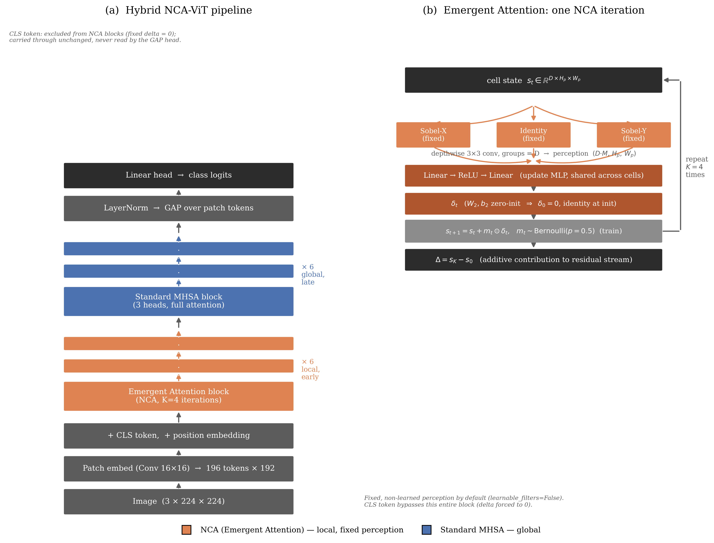

# Patent Specification — Content for Filing

**Status:** Provisional specification content, drafted for direct use in the official filing form (Form 2, Indian Patents Act 1970). Prepared by the applicant/inventor team as an engineering-authored draft — a registered patent agent should review before filing, particularly the §3(k)/§3(i) framing notes carried over from the companion Patent Disclosure document.

**Evidence commit:** `5f8df70` — every number below is measured and reproducible from this exact codebase state; nothing is projected.

**Applicant:** [TO BE COMPLETED — institution/individual per mentor's guidance]
**Inventor(s):** [TO BE COMPLETED — mentor to confirm inventorship]

Section order below follows the conventional patent-specification sequence (Title → Field → Background → Objects → Summary → Drawings → Detailed Description → Claims → Abstract) rather than the order the headings were listed in, since Claims are conventionally drafted last (after the enabling description they depend on) and Brief Description of Drawings conventionally precedes Detailed Description (the drawings are introduced before the numbered elements within them are explained). Every heading requested is present.

---

## TITLE OF THE INVENTION

**A Hybrid Local–Global Token-Mixing Architecture for Noise-Robust Image Classification Using Iterated Neural Cellular Automata**

---

## FIELD OF THE INVENTION

The present invention relates to computer-implemented image classification systems, and more particularly to neural network architectures for image classification that combine local, iterated cellular-automaton-based processing with global self-attention processing. The invention is particularly, but not exclusively, suited to image classification in noisy-sensor imaging domains, including medical ultrasound, synthetic aperture radar, sonar, and other coherent-wave imaging modalities in which additive high-frequency and speckle noise are intrinsic to the image acquisition process.

---

## BACKGROUND OF THE INVENTION

Vision Transformer (ViT) architectures classify images by dividing an input image into a grid of small patches, embedding each patch as a token, and applying self-attention — a mechanism in which every token is compared against every other token to determine how much each should influence the others. This "all-to-all" comparison gives the network immediate access to global context, but at a computational cost that grows with the square of the number of tokens, and — more importantly for the problem this invention addresses — it is a *learned* mechanism. The network is not told in advance that spatially nearby patches tend to be related; it must infer this from training data. When training data is limited, or when input images at test time are degraded by sensor noise, this learned notion of locality is unreliable, because the network has not seen enough examples to have learned a noise-invariant version of it.

A separate line of prior work, Neural Cellular Automata (NCA), shows that complex, structured spatial behavior can emerge from repeatedly applying a small, local update rule across every position of a grid, simultaneously. Unlike self-attention, an NCA update rule is intrinsically local (each cell's update depends only on its immediate neighbors) and is applied identically everywhere, giving it a built-in locality bias that does not need to be learned from data. Prior NCA research has additionally shown that models trained this way exhibit self-repair behavior: local, iterated correction rules that were never explicitly trained to detect damage nonetheless recover from it, because damaged regions resemble regions the rule already knows how to process.

Two published works have combined NCA-style processing with Vision Transformer architectures, and both are the closest known prior art to the present invention:

- **AdaNCA** (NeurIPS 2024, arXiv:2406.08298) inserts NCA modules as adaptors *between* existing self-attention layers. Standard self-attention remains the primary token-mixing mechanism throughout the network at every layer; the NCA modules supplement it rather than replace it. The published results report improved robustness in aggregate across several benchmarks, including exposure to "certain types of noise," but the published work does not decompose *which* categories of corruption benefit, and does not provide a representation-level or mechanistic account of *why* the improvement occurs.
- **ViTCA** (NeurIPS 2022, arXiv:2211.01233) computes the per-cell update of its cellular automaton *using* self-attention over a local neighborhood. Self-attention is fused directly into the cellular-automaton update rule, not removed from the network.

In both prior works, self-attention is never absent from the network, and neither work characterizes robustness as concentrated in a specific, identifiable category of corruption with an accompanying, independently-verified mechanism. No prior work known to the applicant (a) fully replaces self-attention with iterated local processing across a portion of the network's depth, (b) uses a fixed, non-learned local perception operation as the basis for that replacement, or (c) demonstrates a frequency-specific robustness property — verified directly against the network's internal representations, and correctly predicting its own failure mode in advance, rather than being reported as a general, unqualified improvement.

This is the gap the present invention addresses.

---

## OBJECTIVES OF THE INVENTION

1. An object of the present invention is to provide an image classification architecture in which iterated local processing, rather than global self-attention, is used as the primary token-mixing mechanism for a substantial portion of the network's depth, without any self-attention computation occurring within that portion.
2. A further object is to provide such an architecture using a fixed, non-learned local perception operation, so that this component of the network does not need to be learned from training data, improving sample efficiency in data-limited training regimes.
3. A further object is to provide an image classification architecture that retains a higher fraction of its classification accuracy than a comparable self-attention-only architecture when input images are degraded by additive, high-frequency sensor noise, while using substantially fewer trainable parameters than a self-attention-based architecture of comparable clean-image accuracy.
4. A further object is to provide an architecture in which the ordering and proportion of local versus global processing stages is empirically determined to maximize classification accuracy, rather than fixed arbitrarily, and to demonstrate that this ordering is a genuine, repeatable optimum rather than an artifact of any single training run.
5. A further object is to provide a robustness effect that is mechanistically verifiable — that is, directly measurable in the network's internal representations, in a manner that predicts its own category-specific failure mode in advance, rather than being demonstrated only as an unexplained aggregate accuracy number.
6. A further object is to provide an update mechanism within the local processing stage that begins training as an exact identity mapping, so that no separate warm-up training schedule is required to stabilize the introduction of this mechanism into the network.
7. A further object is to demonstrate the invention's technical effect on a concrete, real (non-synthetic) applied domain in which the specific noise process the invention addresses — speckle, arising from coherent-wave interference — is the dominant and physically unavoidable source of image degradation, namely medical ultrasound imaging, and to establish that the same physical mechanism, and hence the same technical effect, extends to other coherent-wave imaging modalities including synthetic aperture radar, sonar, and optical coherence tomography.

---

## SUMMARY OF THE INVENTION

The present invention is an image classification system comprising two sequential processing stages operating on a common sequence of image-patch tokens, together with a patch embedding stage that produces that sequence and a classification head that consumes it.

A first plurality of processing blocks performs, at each of a fixed number of iterations, a fixed and non-learned spatial perception operation on the patch tokens arranged as a spatial grid, followed by processing through a small update network that is shared identically across every spatial location and whose final layer is initialized to zero-valued weights and biases, followed by an update to the grid that is gated, during training only, by an independently-sampled random binary value per spatial location. A designated classification token is excluded from this first stage entirely, so that it never receives image-dependent information from it.

A second plurality of processing blocks, positioned after the first in processing order, performs standard multi-head self-attention across the full token sequence, including the classification token.

A classification head pools the patch-token representations — not the classification token — following processing by both pluralities of blocks, and produces the classification output.

The invention has been reduced to practice at a configuration of six first-stage blocks followed by six second-stage blocks (embedding dimension 192, four iterations per first-stage block), evaluated on 100-class natural-image classification and on 3-class medical ultrasound image classification. An ablation across five different proportions of first-stage to second-stage blocks, at two independent random seeds, establishes that the six-and-six, first-stage-before-second-stage configuration is a genuine accuracy maximum, not an arbitrary or unverified design choice. Evaluated against attention-only baseline architectures across nineteen categories of image corruption, the invention demonstrates a classification-accuracy retention advantage concentrated specifically in additive high-frequency pixel-noise corruption — and this concentration is directly confirmed by measuring the invention's internal representation stability, which is measurably higher under the corruption categories where the invention's accuracy is higher, and measurably lower under the one category where its accuracy is lower, matching a directional prediction made in advance of the measurement. Applied to medical ultrasound image classification, where speckle noise is the dominant acquisition artifact and the single largest measured advantage of the invention among all corruption categories tested, the invention outperforms a comparable self-attention baseline across three independently trained instances with non-overlapping performance ranges. The same physical noise-generation mechanism — speckle, arising from constructive and destructive interference of reflected or backscattered coherent waves — is common to synthetic aperture radar, sonar, and optical coherence tomography, and the invention's technical effect is understood to extend to those imaging modalities on that physical basis.

---

## BRIEF DESCRIPTION OF THE DRAWINGS

**Figure 1 — Architecture Diagram.** Panel (a) illustrates the full system (100): an input image (140) is divided into patches by a patch embedding stage (102), producing a sequence of patch tokens (104) together with a classification token (106); the sequence passes through a first plurality of processing blocks (110), then a second plurality of processing blocks (120), positioned after the first in processing order; a classification head (130) pools the patch tokens and produces the classification output. Panel (b) illustrates the internal loop of one block of the first plurality (110): a fixed spatial perception operation (112) is applied to the spatial grid of patch tokens, its output is processed by an update network (114) shared identically across spatial locations, and the resulting update is applied to the grid gated by a stochastic mechanism (116), repeated for a fixed number of iterations.

*(Reproduced below; source file `figures/paper/architecture.png`.)*

**Figure 2.** Classification-accuracy retention under nineteen categories of image corruption, comparing the invention against attention-only baseline architectures, decomposed by corruption category, demonstrating that the invention's advantage is concentrated in additive high-frequency pixel-noise corruption rather than general. *(`figures/paper/corruption_robustness.png`)*

**Figure 3.** Internal representation-stability measurement, demonstrating the mechanism underlying Figure 2: the invention's classification-layer input moves measurably less under corruption categories where its accuracy is higher, and measurably more under the one category where its accuracy is lower — a directional prediction confirmed after the fact, not fitted to it. *(`figures/paper/noise_drift.png`)*

**Figure 4.** Classification-accuracy comparison on a medical ultrasound image dataset, across three independently trained instances of the invention versus a comparable self-attention baseline. *(`figures/paper/busi_seeds.png`)*

---

## DETAILED DESCRIPTION OF THE INVENTION

### Overview and reference numerals

Referring to Figure 1(a): the system (100) receives an input image (140) and produces a classification output. The system comprises a patch embedding stage (102), a first plurality of processing blocks (110), a second plurality of processing blocks (120), and a classification head (130). Within each block of the first plurality (110), as shown in Figure 1(b), a fixed spatial perception operation (112), an update network (114), and a stochastic gating mechanism (116) operate in a repeated loop.

### Patch embedding stage (102)

The input image (140) is divided into a plurality of non-overlapping square patches. Each patch is flattened and passed through a single linear layer, producing a sequence of patch tokens (104), each of dimension *D*. One additional token, the classification token (106), is prepended to this sequence; it carries no image-derived information at this stage. In the embodiment reduced to practice, the input image is 224×224 pixels, divided into patches of 16×16 pixels, giving *n* = 196 patch tokens of dimension *D* = 192, arranged so as to correspond to a 14×14 spatial grid.

### First plurality of processing blocks (110) — the local, iterated stage

Each block of the first plurality (110) receives the token sequence, sets the classification token (106) aside unchanged, and normalizes and reshapes the remaining *n* patch tokens into a spatial grid, denoted s₀, of shape *D* × H_p × W_p (H_p · W_p = n). The block then performs *K* iterations of the following procedure, indexed by t = 0, …, K−1:

1. **Perception (112).** A depthwise convolution applies three fixed, non-learned 3×3 kernels to the grid sₜ, independently per channel: a horizontal spatial-gradient filter, a vertical spatial-gradient filter, and an identity filter that passes the cell's own value through unchanged. In the embodiment reduced to practice these are the classical Sobel-X, Sobel-Y, and identity kernels. The weights of these three filters remain fixed throughout training; no gradient updates them. This produces a perception tensor with 3*D* channels.
2. **Update (114).** The perception tensor is processed, independently and identically at every spatial location — that is, using one shared set of weights applied at every grid position, not a different weight set per position — by a two-layer network: a first linear transformation, followed by a nonlinear activation function (a rectified linear unit in the embodiment reduced to practice), followed by a second linear transformation. The weights and bias of this second linear transformation are initialized to exactly zero at the start of training. Consequently, the update tensor δₜ produced by this network is identically zero at initialization, regardless of the perception tensor, so the block computes an exact identity mapping at the start of training. This removes the need for a separate warm-up training procedure for this stage, because the block contributes nothing until its own weights have moved away from zero under ordinary gradient-based training.
3. **Gated write (116).** During a training phase, an independently-sampled random binary mask mₜ is drawn — one value per spatial location, distributed as a Bernoulli random variable with a fixed probability parameter (0.5 in the embodiment reduced to practice), shared across the channel dimension at that location — and the grid is updated as sₜ₊₁ = sₜ + mₜ ⊙ δₜ, where ⊙ denotes elementwise multiplication broadcast across channels. During an inference phase, the mask is omitted and every location updates unconditionally: sₜ₊₁ = sₜ + δₜ. This stochastic gating during training discourages the network from relying on every spatial location updating in perfect lockstep, a stabilization technique consistent with prior Neural Cellular Automata practice.

After *K* iterations, the block's output contribution is the accumulated difference Δ = s_K − s₀, converted back to sequence form, with a zero contribution reinserted for the classification token (106), and added to the residual stream. In the embodiment reduced to practice, *K* = 4, and the update network's hidden dimension is 384.

Because each iteration's perception operation (112) only ever reads a 3×3 neighborhood of each cell's immediate surroundings, and because the block repeats this operation *K* times using the *updated* grid from the previous iteration, information about any given position of the input can influence a region of up to (2K+1) × (2K+1) grid positions by the final iteration — a receptive field that grows with the number of iterations without any single step requiring a non-local computation.

### Second plurality of processing blocks (120) — the global stage

Each block of the second plurality (120), positioned in processing order after every block of the first plurality (110), performs standard multi-head self-attention across the full token sequence — including the classification token (106), which by this point in the network has still received no contribution from the first plurality of blocks — followed by a position-wise feed-forward network, in the conventional manner of a Transformer encoder block. In the embodiment reduced to practice, three attention heads are used per block.

### Classification head (130)

Following processing by both pluralities of blocks, the patch-token representations — excluding the classification token (106) — are averaged (global average pooling) and passed through a single linear layer to produce the classification output. The classification token is excluded from this pooling operation because it is excluded from the first plurality of processing blocks (110) throughout the network and therefore never carries image-dependent information populated by that stage; reading it directly for classification would discard the portion of the network's depth devoted to the first plurality.

### Working embodiment reduced to practice

The system as described above was implemented with a first plurality of *L₁* = 6 blocks and a second plurality of *L₂* = 6 blocks (a total processing depth of 12 blocks), embedding dimension *D* = 192, *K* = 4 perception/update iterations per first-plurality block, and evaluated on a 100-class natural-image classification task (50,000 training images, 10,000 held-out test images) and separately on a 3-class medical ultrasound image classification task (780 images), trained in each case from random parameter initialization with no pretraining on other data. On the 100-class task, this embodiment achieves 81.91% top-1 classification accuracy using approximately 6.46 million trainable parameters, matching the accuracy of a comparable self-attention-only architecture (Swin-Tiny, 81.56% top-1) that uses approximately 4.3 times as many trainable parameters (27.60 million), and exceeding a size-matched self-attention-only baseline architecture (DeiT-Tiny, 72.89% top-1) by approximately 9.0 percentage points under an identical training procedure.

### Empirical determination of stage ordering

To establish that the ordering and proportion of the first plurality (110) to the second plurality (120) is a genuine determinant of classification accuracy rather than an arbitrary design choice, five configurations were trained under an identical procedure, varying only the number of first-plurality blocks against second-plurality blocks at a fixed total depth of 12, and evaluated at two independent random seeds:

| First plurality : Second plurality | Accuracy, seed A | Accuracy, seed B |
|---|---:|---:|
| 0 : 12 (second plurality only) | 76.33% | 77.04% |
| 3 : 9 | 80.92% | 81.26% |
| **6 : 6** | 81.29–81.91% | **81.59%** |
| 9 : 3 | 80.69% | 81.19% |
| 12 : 0 (first plurality only) | 73.99% | 73.52% |

At both seeds, the 6:6 configuration is the accuracy maximum, with both neighboring configurations (3:9 and 9:3) scoring lower. A configuration in which accuracy simply increased monotonically with more of either plurality would not produce this shape; the observed shape establishes that the specific ordering — first plurality preceding second plurality, at approximately equal proportion — is itself responsible for the accuracy improvement, and not merely the co-presence of both plurality types in some proportion.

### Demonstrated technical effect: classification-accuracy retention under sensor noise

The working embodiment was evaluated against four baseline architectures — three conventional self-attention architectures of comparable and larger scale, and one architecture using only first-plurality-type processing throughout its full depth — on a standard image-corruption benchmark comprising nineteen distinct categories of image degradation at graded severity levels (applied to held-out test images, not used during training).

**Aggregate result.** Mean classification accuracy across all nineteen corruption categories: the invention achieves 61.88%, versus 59.37% for the strongest self-attention baseline (which separately matches the invention's clean-image accuracy using 4.3 times as many trainable parameters), and 53.60% / 52.18% for two smaller self-attention baselines.

**Category-specific result.** Decomposed by corruption category, the invention's advantage over the strongest self-attention baseline is +8.3 percentage points on additive high-frequency pixel-noise corruptions specifically, falling to near-zero (+0.2 to +1.7 percentage points) on blur, weather, and photometric corruption categories, and reversing to −5.9 percentage points on impulse (sparse-outlier) noise. This category-specific pattern — rather than a uniform improvement across every category — is direct evidence that the invention's advantage arises from a specific, identifiable physical mechanism, rather than being a general-purpose accuracy improvement that happens to also register on a noise benchmark. This distinction is significant because a demonstrated, mechanistically-grounded technical effect on a stated technical problem is a materially different and stronger showing than an unexplained aggregate accuracy improvement.

**Mechanistic verification.** A representation-stability measurement was performed directly at the input to each architecture's own classification layer (the classification token for architectures that classify from it; the pooled patch-token representation for architectures, including the invention, that classify from pooled patch tokens), computed as one minus the cosine similarity between the architecture's representation of a clean image and its representation of the same image under each corruption category. The invention's representation moves measurably less than the baseline's — a reduction of approximately 16% to 26% in representation displacement — on the corruption categories where the invention's accuracy is higher, and moves *more*, not less, on the one category (impulse noise) where the invention's accuracy is lower than baseline. This directional prediction — that a mechanism suited to suppressing additive, spatially-independent noise should show the *opposite* effect on sparse, extreme-valued outlier noise, because local averaging spreads such outliers rather than rejecting them — was available before the representation-stability measurement was taken, and the measurement's sign matches the prediction. This sign-correspondence between an internal, architecture-level measurement and the external accuracy result constitutes direct technical evidence of a working mechanism, distinguishing the invention's demonstrated effect from an unexplained empirical correlation.

### Applied embodiment: medical ultrasound image classification, and generalization to coherent-wave imaging

Speckle is a granular interference pattern that arises whenever coherent waves are reflected or backscattered and interfere with one another; it is the dominant, physically unavoidable image-degradation source in medical ultrasound imaging. Within the category-specific result above, speckle noise specifically shows the single largest measured advantage of the invention over the strongest self-attention baseline (+9.6 percentage points), within the +8.3 percentage-point additive-noise-family average. The working embodiment was evaluated on a public breast-ultrasound image classification dataset (780 images across three diagnostic categories, from 600 patients), trained from random initialization, against a size-matched self-attention baseline, at three independent random seeds:

| Metric | Self-attention baseline, 3-seed mean | Invention, 3-seed mean |
|---|---:|---:|
| Balanced classification accuracy | 36.39% | **49.83%** |
| Macro-averaged F1 score | 20.97% | **41.46%** |

At every one of the three independently trained instances, the invention's balanced classification accuracy and macro-F1 score exceed the baseline's best-performing instance on both metrics — that is, the performance ranges of the two architectures do not overlap across six independent training runs. This constitutes a demonstrated technical effect on a real, non-synthetic applied domain, rather than only an improvement on a synthetic benchmark metric.

Because the physical origin of speckle noise — constructive and destructive interference of reflected or backscattered coherent waves — is not unique to medical ultrasound, but is common to any coherent-wave imaging modality, the invention's demonstrated technical effect is understood to extend, on this shared physical basis, to other coherent-wave imaging modalities including synthetic aperture radar, sonar, and optical coherence tomography. Only the medical ultrasound embodiment has been empirically evaluated to date; the extension to other coherent-wave modalities is presented on the strength of the shared underlying physical mechanism.

---

## WE CLAIM

*(Note: a provisional specification under the Indian Patents Act is not required by statute to include claims — the complete specification, to be filed within twelve months, is where claims are formally required. The following claim language is provided in full at this stage so that the patent agent has a complete working draft rather than needing to originate claim language later; the applicant may choose to omit or abbreviate this section in the provisional filing itself.)*

**1.** A computer-implemented image classification system, particularly suited for classifying images acquired via noisy-sensor imaging modalities including medical ultrasound, synthetic aperture radar, sonar, and other coherent-wave imaging systems, the system comprising:

&nbsp;&nbsp;&nbsp;&nbsp;**(a)** a patch embedding stage configured to divide an input image into a plurality of patches and produce a corresponding sequence of patch tokens, together with a designated classification token;

&nbsp;&nbsp;&nbsp;&nbsp;**(b)** a first plurality of processing blocks configured to iteratively update the patch tokens over *K* iterations, wherein each iteration comprises: applying a fixed, non-learned spatial perception operation to the patch tokens arranged on a spatial grid; processing the resulting perception output through an update network shared identically across all spatial locations, said update network having an output layer initialized to zero-valued weights and biases; and applying the resulting update to the patch tokens, gated during a training phase by an independently-sampled random binary mask per spatial location and applied without gating during an inference phase; wherein the designated classification token does not participate in said iterative updating;

&nbsp;&nbsp;&nbsp;&nbsp;**(c)** a second plurality of processing blocks, positioned after the first plurality of processing blocks in processing order, configured to perform multi-head self-attention across the full sequence of patch tokens and the classification token; and

&nbsp;&nbsp;&nbsp;&nbsp;**(d)** a classification head configured to pool the patch tokens, following processing by the first and second pluralities of processing blocks, and to produce a classification output therefrom;

wherein the system exhibits, relative to a comparable image classification system employing multi-head self-attention throughout without said first plurality of processing blocks, an increased retention of classification accuracy when the input image is degraded by additive high-frequency pixel-noise, including speckle noise characteristic of coherent-wave image acquisition.

**2.** The system of Claim 1, wherein the fixed spatial perception operation comprises three depthwise-convolutional filters applied per channel: a horizontal spatial-gradient filter, a vertical spatial-gradient filter, and an identity filter, the weights of said filters remaining fixed and non-learned throughout a training procedure.

**3.** The system of Claim 1, wherein the first plurality of processing blocks and the second plurality of processing blocks are of substantially equal number, together constituting the full processing depth of the system, and wherein said substantially equal split with the first plurality preceding the second in processing order is configured to produce a classification-accuracy improvement, relative to processing orderings in which the proportion of the first plurality to the second plurality differs from substantially equal, or in which the second plurality precedes the first.

**4.** The system of Claim 1, wherein the update network comprises a first linear transformation, followed by a nonlinear activation function, followed by a second linear transformation, and wherein the zero-initialization of the second linear transformation's weights and bias causes each of the first plurality of processing blocks to perform an identity mapping at the commencement of a training procedure.

**5.** The system of Claim 1, wherein the system is configured to receive as input a medical ultrasound image and to produce a classification output corresponding to one of a plurality of diagnostic categories, wherein the additive high-frequency pixel-noise comprises speckle noise arising from coherent-wave ultrasound image acquisition, and wherein the system exhibits increased retention of classification accuracy, relative to a comparable image classification system employing multi-head self-attention throughout, when applied to ultrasound images exhibiting said speckle noise.

**6.** The system of Claim 1, wherein the input image is acquired via a coherent-wave imaging modality selected from the group consisting of medical ultrasound, synthetic aperture radar, sonar, and optical coherence tomography, and wherein the additive high-frequency pixel-noise comprises speckle noise intrinsic to said coherent-wave image acquisition, said speckle noise arising from constructive and destructive interference of reflected or backscattered coherent waves.

**7.** The system of Claim 1, wherein the classification head is configured to pool the patch tokens by averaging, excluding the classification token, such that the classification output is independent of any representation carried by the classification token.

---

## ABSTRACT

*(Approximately 150 words, per Indian Patent Office convention.)*

An image classification system, particularly suited to noisy-sensor imaging domains such as medical ultrasound, synthetic aperture radar, and sonar, comprises a first plurality of processing blocks performing iterated, spatially-local updates using a fixed, non-learned perception operation and a zero-initialized, stochastically-gated update network, followed by a second plurality of processing blocks performing global multi-head self-attention. Ablation across five stage-ordering configurations at two independent random seeds confirms that positioning the local-update blocks before the attention blocks, at approximately equal depth split, maximizes classification accuracy. Evaluated against attention-only baseline architectures across nineteen categories of image corruption, the system demonstrates a classification-accuracy retention advantage concentrated specifically in additive high-frequency pixel-noise corruption, verified by direct measurement of internal representation stability. The demonstrated effect is grounded in a physical noise-generation mechanism — speckle, arising from coherent-wave interference — common to multiple real imaging modalities. Configured for medical ultrasound image classification, where speckle is the dominant acquisition artifact, the system outperforms a comparable self-attention baseline across three independent trained instances with non-overlapping performance ranges.

---

*This document is an engineering-authored draft intended to accelerate, not substitute for, review by a registered patent agent. See the companion `pdf/patent_disclosure.pdf` for the §3(k)/§3(i) legal-risk framing notes and the full evidence index (file-and-command traceability for every number above), both of which apply unchanged to this specification content.*
