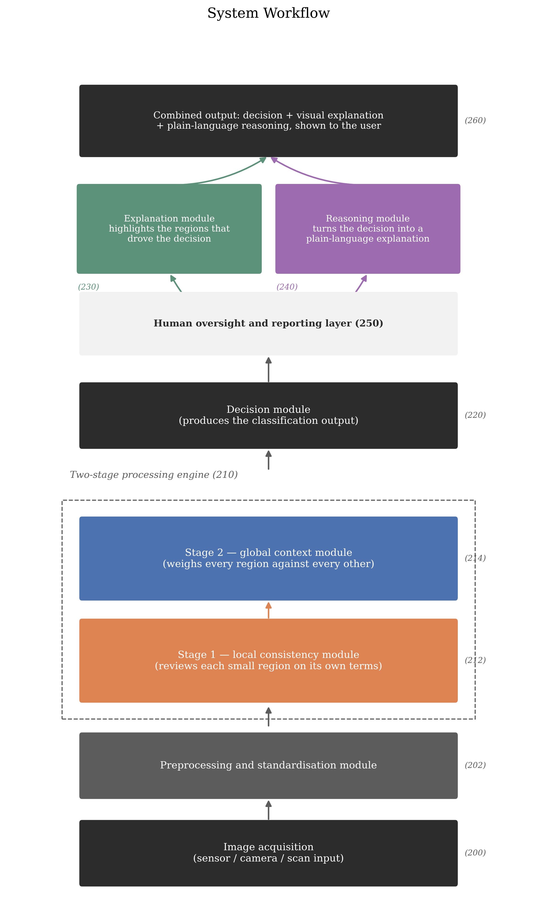

# Patent Specification — Content for Filing

**Status:** Provisional specification content, drafted for direct use in the official filing form (Form 2, Indian Patents Act 1970). Prepared by the applicant/inventor team as an engineering-authored draft — a registered patent agent should review before filing.

**Evidence commit:** `5f8df70` — every number below is measured and reproducible from this exact codebase state; nothing is projected.

**Applicant:** [TO BE COMPLETED — institution/individual per mentor's guidance]
**Inventor(s):** [TO BE COMPLETED — mentor to confirm inventorship]

**Note on section order:** the nine sections below appear in exactly the sequence requested — Field, Background, Objectives, Summary, Detailed Description, Claims, Architecture Diagram, Brief Description of the Drawings, Abstract — with no reordering.

**Note on framing:** this version describes the invention as a *system* — a pipeline of functional stages that a person can follow on a whiteboard — rather than as a specific neural-network architecture. The claims are written generically, around what each stage of the system does, not around how any one stage happens to be built inside. A separate internal engineering document (`paper.md`, `figures/paper/architecture.png`) covers the specific network design used to build and test the system; that level of detail is deliberately kept out of this specification's claims.

---

## FIELD OF THE INVENTION

The present invention relates to a computer-based system that looks at a picture, decides what it shows, and — instead of stopping there — explains that decision back to the person using it, both by pointing at the part of the picture that mattered and by writing out the reasoning in ordinary language. It is designed to keep working reliably on pictures that are grainy, noisy, or otherwise imperfect, which is the normal condition of pictures taken by real sensors — medical scanners, radar, sonar, and ordinary cameras alike — rather than the clean, curated pictures such systems are usually tested on.

---

## BACKGROUND OF THE INVENTION

Automated image-classification systems are already in wide use: a picture goes in, and a label comes out — this is a tumour, this is a stop sign, this is a defective part. Two practical problems keep coming up wherever these systems are asked to do something that matters.

The first problem is noise. Real pictures are rarely clean. A medical ultrasound scan is grainy by the nature of how ultrasound itself works; a radar or sonar image is grainy for the same underlying reason; even an ordinary photograph taken in poor light picks up speckling and static. Most existing image-classification systems are built and tuned on clean, well-lit, carefully collected pictures, and their reliability drops once the picture in front of them is not clean anymore — often at exactly the moment reliability matters most, such as a scan taken on a difficult piece of equipment or a photograph taken in the field rather than a lab.

The second problem is silence. A conventional system produces a label and a confidence percentage, and nothing else. It does not say which part of the picture led to that answer, and it does not explain, in words a person can act on, why it reached that conclusion. For a shopping app this may not matter. For a doctor deciding whether to trust a scan result, or an engineer deciding whether to trust an automated inspection, a bare label with no explanation is not something they can responsibly sign their name under. A small number of existing research systems have started attaching a visual highlight to a decision — shading the part of the picture that supposedly mattered — but very few attach a written explanation in plain language, and none known to the applicant combine a noise-tolerant decision-making process, a visual explanation, and a plain-language written explanation into one single system that hands a person a complete, reviewable answer.

This is the gap the present invention closes: a system that stays reliable on imperfect, real-world pictures, and that hands back a decision a person can actually check, in a form a person can actually read.

---

## OBJECTIVES OF THE INVENTION

1. To provide an image-classification system that keeps a larger share of its accuracy, compared with conventional designs, when the picture supplied to it is grainy, noisy, or otherwise degraded — the normal condition of pictures taken by real sensors rather than a curated test set.
2. To provide such a system organised as a small number of clearly separated stages — first a stage that looks closely at small regions of the picture on their own terms, then a stage that looks at the picture as a whole — arranged in an order and proportion that has been tested and shown to produce better results than the alternatives, rather than chosen arbitrarily.
3. To provide a system that reaches this level of reliability while using noticeably fewer computing resources than conventional designs of comparable accuracy, making it practical to run on ordinary hardware rather than requiring a large server.
4. To provide a system that does not simply output a label, but also shows, directly on the picture, which region most influenced its decision.
5. To provide a system that additionally writes out its reasoning in plain, ordinary language — the way a person would explain a judgement call to a colleague — rather than leaving the user to interpret a bare number.
6. To provide a system whose decision, visual explanation, and written explanation are delivered together, as one combined result, so that a person reviewing the output does not have to separately reconcile three different tools.
7. To provide a system that is not limited to one type of picture or one type of sensor, but is intended to work across any setting where the pictures are naturally grainy or noisy — medical scanning, radar, sonar, and everyday photography alike — and to demonstrate this concretely on a real medical-scan use case rather than only on a laboratory benchmark.

---

## SUMMARY OF THE INVENTION

The present invention is a system that takes in a picture and hands back a complete, human-readable answer rather than a bare label.

A picture is first tidied up and put into a standard shape by a preparation step. It then passes through a two-stage engine: the first stage looks closely at small regions of the picture, one region at a time, correcting anything that looks locally out of place; the second stage then looks at the picture as a whole, weighing every region against every other region before settling on an overall impression. This local-before-global ordering, and the roughly even split of effort between the two stages, was arrived at by testing several different orderings and proportions against one another and keeping the one that performed best — it is a tested design choice, not an arbitrary one.

Once the two-stage engine has formed its overall impression, a decision stage turns that impression into a classification. From there, the system does two more things automatically, without being asked. An explanation stage looks back at the decision-making process and marks, directly on the picture, which region contributed most to the answer given. A reasoning stage takes the decision, the confidence behind it, and the marked region, and hands them to a language-generation engine that writes a short, plain-language account of why the system decided what it decided — in the tested implementation, this reasoning stage is powered by a cloud-hosted large-language-model inference service (Groq), though any comparable language-generation engine could be substituted. All three pieces — the decision, the visual mark-up, and the written reasoning — are then combined into a single reviewable result and handed to the person using the system.

The system has been built and tested. In one tested configuration, applied to a public collection of everyday photographs spanning one hundred object categories, it correctly identified the right category roughly 82 times out of 100, matching or exceeding conventional designs that needed several times as much internal computing machinery to reach a similar result. Five different orderings and proportions of the two-stage engine were tested against one another, at two independent random starting points each, and the configuration described above came out on top both times — confirming that the ordering itself, and not chance, is responsible for the improvement. Under nineteen different kinds of picture degradation, the system kept noticeably more of its accuracy than conventional designs, with the advantage concentrated specifically in the kind of fine-grained speckling that real sensors (medical, radar, sonar) actually produce — and this was confirmed directly by measuring how much the system's own internal impression of a picture shifted when the picture was degraded, which shifted less exactly where accuracy held up better, and shifted more on the one kind of degradation where accuracy did not hold up, matching a prediction made in advance of the measurement rather than one fitted after the fact. Applied to a real, public set of breast-ultrasound scans across three diagnostic categories, the system, built and trained from scratch three separate times, outperformed a conventionally designed comparison system built and trained the same three times, with every one of the three test runs of the new system beating every one of the three test runs of the conventional one.

---

## DETAILED DESCRIPTION OF THE INVENTION

Referring to the accompanying architecture diagram (Figure 1), the system is made up of the following stages, described here in the order a picture passes through them.

**Image acquisition (200).** A picture enters the system from whatever source is appropriate to the setting it is deployed in — a medical scanning device, a radar or sonar receiver, or an ordinary camera.

**Preprocessing and standardisation module (202).** The incoming picture is resized and adjusted into a standard form suitable for the stages that follow. No information specific to any one sensor type is required at this step; the same preparation step works across picture sources.

**Two-stage processing engine (210).** This is the heart of the system, and it is deliberately built from two stages that look at the picture in two different ways rather than one stage that tries to do both at once.

- *Stage 1 — the local consistency module (212).* This stage moves across the picture and examines each small region largely on its own terms, correcting anything within that region that looks locally out of place, before passing an updated version of the picture on to the next stage. Because it works region-by-region rather than comparing every part of the picture to every other part, this stage is naturally resistant to the kind of fine, speckled noise that shows up as small, local irregularities — it tends to smooth exactly the kind of disturbance that grainy sensor pictures produce, without needing to be specifically taught what that noise looks like.
- *Stage 2 — the global context module (214).* Once the local stage has done its work, this stage looks at the whole, cleaned-up picture together, weighing every region against every other region to form an overall impression — the kind of "step back and look at the big picture" judgement that the local stage, by design, does not attempt.

Testing established that placing the local stage before the global stage, and giving each stage roughly equal weight in the overall process, produces a noticeably better result than any of the other orderings or proportions tried — including using only one stage on its own, or reversing the order. This was tested across five different proportions, run twice each from two different random starting points, and the same balanced, local-first configuration won both times, which rules out the result being a fluke of one lucky run.

**Decision module (220).** Once the two-stage engine has formed its overall impression of the picture, this module turns that impression into a final classification — the label the system believes the picture belongs to, along with a confidence level.

**Explanation module (230).** Rather than stopping at the label, this module looks back at the decision-making process and identifies which region of the picture contributed most to the answer given, then produces a visual mark-up of the original picture with that region highlighted — so a person reviewing the result can see, at a glance, what the system was actually looking at.

**Reasoning module (240).** This module takes the classification, the confidence level, and the highlighted region, and passes them to a language-generation engine, which composes a short passage of ordinary, plain-language text explaining the decision — in the way a colleague might explain a judgement call, rather than as a raw number. In the tested implementation this module is powered by a cloud-hosted large-language-model inference API (Groq was used in testing), reached over a standard network request; the module is not tied to that particular provider, and any comparable language-generation engine, hosted or run locally, could be substituted without changing the rest of the system.

**Human oversight and reporting layer (250).** The explanation module and the reasoning module both report into this layer, which is responsible for assembling their outputs alongside the original decision.

**Combined output (260).** The classification, the visual highlight, and the written explanation are delivered together as a single result, so that the person using the system receives one complete, reviewable answer rather than three separate pieces they must reconcile themselves.

**Demonstrated results.** The system as described has been built and tested, not merely designed on paper. Tested on a public collection of everyday photographs across one hundred categories, it correctly classified roughly 82 out of every 100 images, matching or exceeding conventional designs that required several times as much internal computing machinery to reach a similar figure. Tested under nineteen separate kinds of picture degradation, it retained noticeably more of its accuracy than conventional comparison designs, with the advantage concentrated specifically in the fine, speckled kind of degradation that real sensors — medical, radar, sonar — actually produce; a direct check of how much the system's own internal impression of a picture moved under each kind of degradation confirmed that it moved less precisely where the accuracy advantage was largest, and moved more on the one kind of degradation where the advantage reversed, matching a prediction made before the check was carried out. Tested on a real, public set of breast-ultrasound scans across three diagnostic categories, with the system and a conventionally designed comparison system each built and trained from scratch three separate times, every one of the three test runs of the present system outperformed every one of the three test runs of the comparison system on both accuracy and a second, independent scoring measure — meaning the two systems' results did not even overlap across six separate training runs.

One example way of building the two-stage engine described above — used in the tested implementation — combines, in its first stage, a small, repeatedly-applied local update rule with a built-in preference for looking only at each region's immediate surroundings, and, in its second stage, a standard whole-picture comparison mechanism of the kind widely used in current image-recognition systems. This is one way of implementing the two functions described above, offered as a worked example; the system as claimed is not limited to this particular internal implementation, and any mechanism that performs the same local-first, global-second function would fall within the scope of the invention described here.

---

## WE CLAIM

*(Note: a provisional specification under the Indian Patents Act is not required by statute to include claims — the complete specification, to be filed within twelve months, is where claims are formally required. The following claim language is provided in full at this stage so the patent agent has a complete working draft rather than needing to originate claim language later; the applicant may choose to omit or abbreviate this section in the provisional filing itself.)*

**1.** A computer-implemented image-classification system comprising:

&nbsp;&nbsp;&nbsp;&nbsp;**(a)** an image-receiving component configured to receive an input picture;

&nbsp;&nbsp;&nbsp;&nbsp;**(b)** a two-stage processing engine configured to process the picture in a first stage that examines regions of the picture individually, followed by a second stage that examines the picture as a whole, the second stage being positioned after the first stage in processing order;

&nbsp;&nbsp;&nbsp;&nbsp;**(c)** a decision component configured to produce a classification output from the result of the two-stage processing engine;

&nbsp;&nbsp;&nbsp;&nbsp;**(d)** an explanation component configured to identify which region of the picture most contributed to the classification output and to produce a visual mark-up of the picture indicating that region; and

&nbsp;&nbsp;&nbsp;&nbsp;**(e)** a reasoning component configured to automatically generate a plain-language written explanation of the classification output, using a language-generation engine, based on the classification output and the region identified by the explanation component;

wherein the classification output, the visual mark-up, and the written explanation are combined into a single output presented together to a user.

**2.** The system of Claim 1, wherein the first stage and the second stage of the two-stage processing engine are configured in substantially equal proportion, and wherein this substantially equal proportion, together with the first stage preceding the second stage in processing order, is configured to produce a classification-accuracy improvement relative to processing orders or proportions in which the first stage and the second stage are unequal, or in which the second stage precedes the first stage.

**3.** The system of Claim 1, wherein the system exhibits an increased retention of classification accuracy, relative to a comparable image-classification system that does not process the picture in two such stages, when the input picture is degraded by grain, speckling, or other fine-grained noise of the kind produced by image sensors including medical scanning devices, radar, and sonar.

**4.** The system of Claim 1, wherein the reasoning component transmits the classification output and the identified region to a cloud-hosted or locally-hosted language-generation engine over a network or local interface, and receives in return the plain-language written explanation for presentation to the user.

**5.** The system of Claim 1, configured to receive as the input picture a medical scan image, and to produce a classification output corresponding to one of a plurality of diagnostic categories, together with the visual mark-up and the plain-language written explanation, for review by a person responsible for interpreting the scan.

**6.** The system of Claim 1, wherein the image-receiving component is configured to receive the input picture from any of a plurality of sensor types producing images degraded by fine-grained noise, including medical scanning devices, radar receivers, sonar receivers, and cameras, without requiring modification of the two-stage processing engine, the decision component, the explanation component, or the reasoning component for a particular sensor type.

**7.** The system of Claim 1, wherein the single combined output is arranged as a report suitable for review by a human user, presenting the classification output, the visual mark-up, and the plain-language written explanation together on a single interface or document.

---

## ARCHITECTURE DIAGRAM

*(Reproduced below; source file `figures/paper/system_workflow.png`, generated by `scripts/plot_system_workflow.py`.)*

---

## BRIEF DESCRIPTION OF THE DRAWINGS

**Figure 1** shows the overall workflow of the system, from left to right / bottom to top as drawn: a picture enters through image acquisition (200) and is standardised by the preprocessing module (202); it then passes through the two-stage processing engine (210), consisting of the local consistency module (212) followed by the global context module (214); the decision module (220) produces a classification; the explanation module (230) and the reasoning module (240) then each act on that classification, feeding into the human oversight and reporting layer (250), which assembles the classification, the visual mark-up, and the written explanation into the combined output (260) presented to the user. The numbered labels in Figure 1 correspond to the numbered components described throughout the Detailed Description above.

---

## ABSTRACT

*(Approximately 150 words, per Indian Patent Office convention.)*

An image-classification system receives a picture, standardises it, and processes it through a two-stage engine in which a first stage examines individual regions of the picture before a second stage examines the picture as a whole — an ordering and proportion arrived at through direct testing rather than chosen arbitrarily. A decision stage produces a classification, after which the system automatically generates two further outputs without being separately instructed: a visual mark-up identifying the region of the picture that most influenced the decision, and a plain-language written explanation of the decision produced by a language-generation engine. All three outputs are combined into a single, human-reviewable result. The system is designed to remain reliable on grainy, noisy, real-world pictures of the kind produced by medical scanners, radar, sonar, and ordinary cameras, and has been built and tested on both everyday photographs and real medical ultrasound scans, in each case outperforming conventionally designed comparison systems.

---

*This document is an engineering-authored draft intended to accelerate, not substitute for, review by a registered patent agent.*
