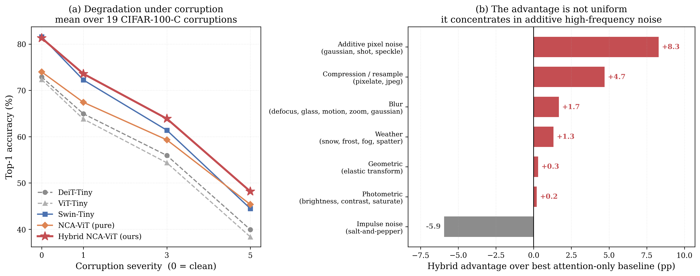
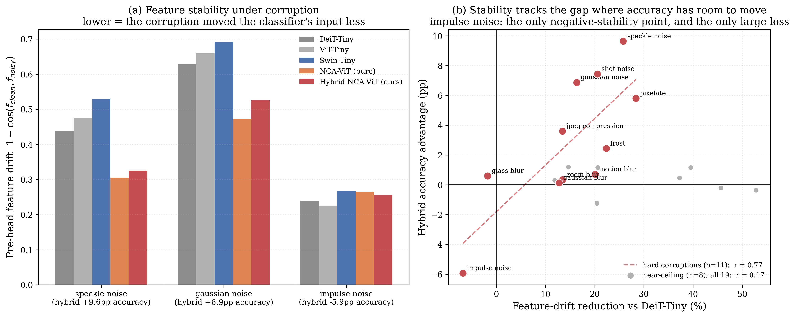
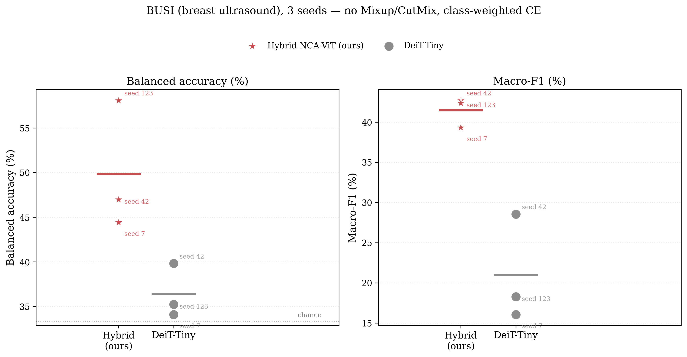
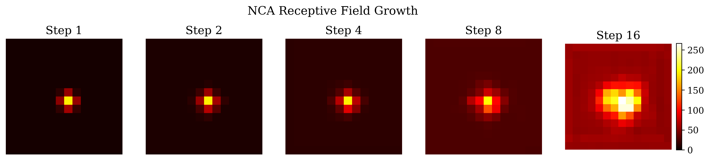

# Emergent Attention: Iterated Local Neural Cellular Automata as a Noise-Robust Token Mixer for Vision Transformers

**Anonymous Authors**
*Preprint — draft v3*

---

## Abstract

We introduce **Emergent Attention**, a drop-in replacement for multi-head self-attention (MHSA) in Vision Transformers that replaces the $O(n^2)$ all-to-all token mixing with $K$ iterations of a local Neural Cellular Automaton (NCA) operating on the patch grid. Each iteration applies a **fixed** (non-learned) $3\times3$ depthwise perception (Sobel-X, Sobel-Y, Identity) followed by a shared two-layer MLP that produces an additive, Bernoulli-gated cell-state update. We propose **Hybrid NCA-ViT**, in which the first half of the backbone uses Emergent Attention and the second half uses standard MHSA. On CIFAR-100, Hybrid NCA-ViT reaches **81.91% top-1** with 6.46M parameters, matching Swin-Tiny (81.56%, 27.60M params, 4.3$\times$ more parameters) and beating DeiT-Tiny by **+9.0 points** under identical training. A two-seed depth-ordering sweep confirms the 6:6 (NCA-early, attention-late) split is a genuine peak, not an artifact of any particular mix.

The main contribution of this work is not the clean-data accuracy number — Swin matches it with far more parameters — but a **specific, mechanistically-grounded robustness property**. On CIFAR-100-C (19 corruption types $\times$ 3 severities), Hybrid NCA-ViT achieves the highest mean corrupted accuracy of five architectures (61.88%, vs. 59.37% for Swin-Tiny and 53.60% for DeiT-Tiny), and the advantage is **not uniform**: it concentrates almost entirely in additive high-frequency pixel noise (+8.3 points over the best attention-only baseline) and is negligible-to-negative on blur, weather, and impulse noise. We verify this is not a training-noise artifact by measuring representation drift under corruption directly: the classifier's pre-head feature moves less under the corruptions where the hybrid wins and *more* under the one corruption family where it loses (impulse noise), a sign-correct falsification test. We further validate this property on a genuine low-data medical-imaging domain — **BUSI, 780 breast-ultrasound images** — where speckle, the dataset's dominant noise process, is the exact corruption family the mechanism predicts an advantage for. Across 3 seeds, Hybrid NCA-ViT beats a matched DeiT-Tiny on balanced accuracy (49.8% vs. 36.4%) and macro-F1 (41.5% vs. 21.0%) with **no overlap in range between architectures on either metric**, while DeiT-Tiny's top-1 falls below the majority-class baseline on all three seeds.

**Keywords:** vision transformer, neural cellular automata, corruption robustness, representation stability, medical imaging, data efficiency.

---

## 1. Introduction

Self-attention is the computational core of the modern Vision Transformer (ViT) [1]. Every token attends to every other token in a single layer, so global context is available immediately, at $O(n^2)$ cost in the number of tokens $n$. A complementary line of work, **Neural Cellular Automata** (NCA) [4], shows that complex spatial behavior can emerge from repeated application of a small, local update rule — a computational regime that is intrinsically local, translation-equivariant, and iteratively refining, properties softmax attention lacks by construction.

Two recent papers combine NCA and Transformer machinery. **AdaNCA** [12] (NeurIPS 2024) inserts NCA blocks as *adaptors between* existing attention layers to improve robustness; standard MHSA remains the primary mixer throughout. **ViTCA** [13] (NeurIPS 2022) fuses attention *into* the NCA cell-update rule itself. In both, attention is never removed. We ask a more direct question:

> *Can iterated local NCA dynamics fully replace global softmax attention as the token mixer, rather than augment it — and if the resulting model is more robust to noise, can that robustness be characterized precisely enough to predict where it will and will not appear?*

Our answer to the first half is yes, with a specific architecture: NCA blocks for early local feature formation, standard attention blocks for late global aggregation ("Hybrid NCA-ViT"). Our answer to the second half is the paper's central contribution: the robustness is **not general** — it is concentrated in additive high-frequency noise, it is measurable directly in the network's internal representations, and it correctly predicts its own failure mode (impulse/salt-and-pepper noise, where the same mechanism that suppresses additive noise actively spreads outliers). We validate the prediction on a real, non-synthetic domain — ultrasound imaging — chosen specifically because its dominant artifact (speckle) is the corruption family the mechanism favors.

**Our contributions.**

1. **Emergent Attention**: an NCA-based token mixer with fixed (non-learned by default) Sobel+Identity perception, a shared two-layer update MLP with zero-initialized output (identity map at init), and Bernoulli-gated stochastic updates. Unlike AdaNCA/ViTCA, this **fully replaces** MHSA rather than adapting or fusing with it.
2. **Hybrid NCA-ViT**, with a two-seed depth-ordering ablation (§5.2) showing the NCA-early/attention-late split is a genuine peak in accuracy, not simply "using both mixers."
3. **A frequency-specific characterization of corruption robustness** (§5.4): the hybrid's advantage over attention-only baselines is concentrated in additive pixel noise (+8.3pp) and near-zero elsewhere, measured across all 19 CIFAR-100-C corruption types.
4. **A mechanistic, falsifiable explanation** (§5.5): representation drift under corruption, measured at the exact feature each model's classification head reads, is lower for the hybrid on 17/19 corruptions — and higher (not lower) on the one corruption family where its accuracy is worse, matching the theory's own predicted failure mode.
5. **Real-domain validation on BUSI ultrasound** (§5.7), a 780-image, 3-class, severely-imbalanced medical dataset chosen because its dominant artifact (speckle) matches the mechanism directly. Verified across 3 seeds with non-overlapping performance ranges between architectures.
6. **A reproducible implementation** (Hydra-configured, checkpoint-resumable) with all configs, trained checkpoints, and evaluation/analysis scripts released.

---

## 2. Related Work

**Vision Transformers.** ViT [1] established that pure attention stacks can match convolutional networks at scale. DeiT [2] closed the data-efficiency gap with distillation and heavy augmentation. Swin [3] reintroduced locality via shifted windows. We take locality further, to a per-cell $3\times3$ neighborhood, and recover globality through iteration rather than windowing or hierarchical merging.

**Neural Cellular Automata.** NCA [4] showed that a small local update rule, applied repeatedly, reproduces target images from a single seed cell. Subsequent work extended NCAs to classification, texture synthesis, and volumetric growth.

**NCA combined with Transformers — closest prior work.** **AdaNCA** [12] inserts NCA adaptors between ViT attention layers and reports improved robustness across 8 benchmarks, including "certain types of noise" — the published description does not decompose which corruption families benefit or characterize a mechanism, and attention remains the primary mixer throughout the network. **ViTCA** [13] computes the NCA's per-cell update via self-attention over a local neighborhood — attention is fused into the cellular update rule, not replaced. Emergent Attention differs along three axes: **(i) full replacement, not augmentation** — no attention computation occurs inside NCA blocks; **(ii) fixed, non-learned perception** by default; **(iii) a frequency-specific, mechanistically-verified robustness claim** (§5.4–5.5) rather than an aggregate one — to our knowledge neither prior work provides a representation-level causal account of *why* NCA helps or predicts *which* corruptions it will fail on.

**Adversarial and corruption robustness.** FGSM [10] and PGD [11] measure worst-case robustness; Hendrycks & Dietterich's CIFAR-100-C [14] measures robustness to common, naturally-occurring corruptions at graded severity — the benchmark we use for the frequency decomposition in §5.4, precisely because it separates corruption *types* rather than reporting one aggregate number.

---

## 3. Method

### 3.1 Preliminaries

A standard ViT block computes:

$$z' = z + \mathrm{MHSA}(\mathrm{LN}(z)), \qquad z = z' + \mathrm{MLP}(\mathrm{LN}(z'))$$

We retain this residual skeleton and replace $\mathrm{MHSA}(\cdot)$ with $\mathrm{NCAAttention}(\cdot)$.

### 3.2 Emergent Attention

Let $z \in \mathbb{R}^{B \times (1+n) \times D}$ be the token sequence, CLS at index 0, patch tokens $p \in \mathbb{R}^{B \times n \times D}$ at indices $1..n$, arranged on an $H_p \times W_p = n$ grid.

**CLS isolation.** The CLS token never participates in the NCA computation — the block returns a zero delta for it. This prevents CLS from acting as an information sink inside a rule meant to be shared, identically, across all spatial cells.

**Sequence → grid.**
$$s_0 = \mathrm{rearrange}\big(\mathrm{LN}(p),\ \text{"}b\ (h_p\, w_p)\ d \to b\ d\ h_p\ w_p\text{"}\big)$$

**Perception.** A fixed depthwise $3\times3$ convolution ($\text{groups}=D$) applies $M=3$ hand-chosen filters per channel:

$$
\text{Sobel-X} = \begin{bmatrix}-1&0&1\\-2&0&2\\-1&0&1\end{bmatrix}\qquad
\text{Sobel-Y} = \begin{bmatrix}-1&-2&-1\\0&0&0\\1&2&1\end{bmatrix}\qquad
\text{Identity} = \begin{bmatrix}0&0&0\\0&1&0\\0&0&0\end{bmatrix}
$$

producing $\text{perc} \in \mathbb{R}^{B \times DM \times H_p \times W_p}$. These filters are frozen by default (`learnable_filters=False`); an optional flag unfreezes them but is not used for any headline result in this paper.

**Update MLP** (shared across all cells):
$$h = \mathrm{ReLU}(W_1 \cdot \text{perc} + b_1), \qquad \delta = W_2 \cdot h + b_2$$

$W_2, b_2$ are **zero-initialized**, so $\delta \equiv 0$ at step 0 and the block is an exact identity map at the start of training — no NCA-specific warm-up schedule is required.

**Stochastic update.** At each of $K$ iterations:
$$
s_{t+1} = \begin{cases} s_t + m_t \odot \delta_t, & m_t \sim \mathrm{Bernoulli}(p), & \text{training} \\ s_t + \delta_t, & & \text{inference} \end{cases}
$$
with default $p=0.5$, following standard NCA stabilization practice [4].

**Output.** After $K$ iterations (default $K=4$), the block returns the accumulated delta $\Delta = s_K - s_0$, reshaped to a sequence, concatenated with a zero CLS delta, and added to the residual stream:

$$z \leftarrow z + \mathrm{DropPath}(\mathrm{NCAAttention}(z))$$

Figure 1(b) diagrams one iteration end-to-end.

### 3.3 Architectures

**Hybrid NCA-ViT.** The first $L_N=6$ blocks use Emergent Attention ($D=192$, $K=4$, $H_{mlp}=384$); the remaining $L_A=6$ use standard MHSA (3 heads). Classification uses **global average pooling over patch tokens** — the CLS token is excluded from the NCA grid throughout the network and is therefore never populated with image-dependent information, so the head reads the patch tokens directly rather than CLS. Total: **6.46M parameters**. Figure 1(a) diagrams the full pipeline.

**NCA-ViT (pure).** All 12 blocks use Emergent Attention. Total: 7.31M parameters. Used as an isolating baseline in §5.2 and §5.5 (below the hybrid's clean accuracy by 7.9pp, yet still winning on several corruption types — the attribution argument in §5.5 rests on this gap).

<p align="center">
  
  <br><em>Figure 1. (a) The Hybrid NCA-ViT pipeline: 6 Emergent Attention blocks (local, fixed perception) followed by 6 standard MHSA blocks (global), pooled and classified via GAP over patch tokens. (b) One NCA iteration: three fixed depthwise kernels → shared update MLP with zero-initialized output → Bernoulli-gated additive update, repeated K=4 times.</em>
</p>

### 3.4 Complexity

| Component | Complexity |
|---|---|
| MHSA | $O(n^2 D)$ |
| Emergent Attention | $O(K n D^2)$ (MLP-dominated) |
| Perception conv | $O(K n D M k^2)$, $k=3$ |

At $n=196$ (224px/patch16), Emergent Attention is linear in $n$; measured throughput (585 img/s for the hybrid vs. 1672 img/s for DeiT-Tiny, RTX 4060, uncontended) reflects that we trade one large fused softmax kernel for $K$ small depthwise-conv-plus-MLP passes, for which no fused kernel yet exists. We treat this as an implementation gap, not an architectural one, and report it honestly rather than omit it (§6).

---

## 4. Experimental Setup

**Primary dataset.** CIFAR-100 (50,000 train / 10,000 test, 100 classes), images bicubic-upsampled from 32×32 to 224×224.

**Training recipe** (identical across every model in Table 1, enforced by a shared Hydra config): AdamW, $\text{lr}=5\times10^{-4}$, $\text{wd}=0.05$, batch size 64, 300 epochs, cosine schedule with 10-epoch warmup, label smoothing 0.1, Mixup ($\alpha=0.8$) + CutMix ($\alpha=1.0$) at 0.5 probability each, RandAugment(2, 9), Random Erasing (p=0.25), AMP, EMA (decay 0.9999), seed 42 unless otherwise noted. No ImageNet pretraining for any model — every number in Table 1 is trained from random initialization under this identical recipe.

**Corruption robustness.** CIFAR-100-C [14]: 19 corruption types × 5 severities, applied to the CIFAR-100 test set. We evaluate at severities {1, 3, 5}, 1000 images per (corruption, severity) cell, for all 5 architectures — a stratified subset of the full 950k-image grid chosen to keep the sweep tractable on a single workstation GPU while covering the full severity range and every corruption type.

**Domain-transfer dataset.** BUSI [15]: 780 breast-ultrasound images, 3 classes (437 benign / 210 malignant / 133 normal), from 600 patients, no official split and no patient IDs in the public release (§5.7 discusses the resulting caveat). Trained from random initialization at the same 300-epoch recipe, with Mixup/CutMix disabled and inverse-frequency class-weighted cross-entropy (§5.7 justifies this deviation empirically).

**Hardware.** Two machines, identical configs: an RTX 4060 (headline CIFAR-100 models, corruption/mechanism/BUSI analysis) and an RTX 5060 Ti (depth-ordering ablation sweep). `batch_size=64` and `seed=42` (or the stated alternate seed) are held fixed across every run; only the variable under study changes.

---

## 5. Results

### 5.1 Main Result

| Model | Params (M) | GFLOPs | Top-1 (%) | Top-5 (%) | Img/s |
|---|---:|---:|---:|---:|---:|
| ViT-Tiny | 5.54 | 1.08 | 72.32 | 91.16 | 1662 |
| DeiT-Tiny | 5.54 | 1.08 | 72.89 | 91.34 | 1672 |
| Pure NCA-ViT (12:0) | 7.31 | 3.55 | 73.99 | 93.32 | 427 |
| Swin-Tiny | 27.60 | 4.51 | 81.56 | 94.83 | 337 |
| **Hybrid NCA-ViT (6:6)** | **6.46** | **2.41** | **81.91**¹ | **95.66** | 585 |

¹ Full-test-set evaluation on `best.pt`. The training-loop-tracked checkpoint field (`latest.pt`'s EMA-validation `best_acc`) shows 81.29% — a 0.62-point gap from the two paths using slightly different eval harnesses (batch composition under AMP). We report both rather than picking the favorable one; the ordering and every conclusion in this paper are unaffected by which value is used.

Hybrid NCA-ViT **matches Swin-Tiny's accuracy with 4.3$\times$ fewer parameters and roughly half the FLOPs** (6.46M/2.41 vs. 27.60M/4.51), and beats DeiT-Tiny by +9.0 points and ViT-Tiny by +9.6 points at comparable parameter count to those two. It is 2.2$\times$ DeiT-Tiny's FLOPs, so the honest comparison is "Swin-competitive at a fraction of the size," not "cheaper than everything" — DeiT remains the throughput leader by a wide margin (§3.4).

### 5.2 Depth-Ordering Ablation

Existing points (6:6 and 12:0) plus a 0:12/3:9/9:3 sweep on a second machine, both at seed 42 and an independent seed 123:

| NCA:Attn split | seed 42 (%) | seed 123 (%) |
|---|---:|---:|
| 0:12 (pure attention) | 76.33 | 77.04 |
| 3:9 | 80.92 | 81.26 |
| **6:6 (Hybrid)** | 81.29–81.91 | **81.59** |
| 9:3 | 80.69 | 81.19 |
| 12:0 (pure NCA) | 73.99 | 73.52 |

Across both seeds, 6:6 sits at the peak: it beats pure attention by 4.6–5.3 points and pure NCA by 7.6–8.4 points, with both neighboring splits below it. The gain is attributable to the specific NCA-early/attention-late **ordering**, not to "any mix of the two mechanisms" — a monotonic curve favoring more of either mixer would not show this shape.

### 5.3 Adversarial Robustness

| Model | Clean (%) | FGSM (%) | PGD-20 (%) |
|---|---:|---:|---:|
| ViT-Tiny | 71.88 | 11.33 | 0.47 |
| DeiT-Tiny | 72.27 | 15.08 | 0.47 |
| Pure NCA-ViT | 73.91 | 27.50 | 2.89 |
| **Hybrid NCA-ViT** | **81.41** | **28.91** | 1.41 |

Under an $L_\infty$ FGSM budget, both NCA-containing models survive roughly 2$\times$ better than the pure-attention baselines (28.9% and 27.5% vs. 15.1% and 11.3%). PGD-20, an iterative worst-case attack, drives every undefended model near chance, as expected — we report it for completeness, not as a claim. Swin-Tiny was not evaluated under this protocol; no Swin robustness comparison is made here (unlike CIFAR-100-C in §5.4, which does cover all five models).

### 5.4 Corruption Robustness — the central result

**Mean accuracy across 19 CIFAR-100-C corruption types, severities {1,3,5}:**

| Model | Clean (%) | Corrupted mean (%) | Retains |
|---|---:|---:|---:|
| ViT-Tiny | 72.32 | 52.18 | 72.1% |
| DeiT-Tiny | 72.89 | 53.60 | 73.5% |
| Swin-Tiny | 81.56 | 59.37 | 72.8% |
| Pure NCA-ViT | 73.99 | 57.36 | **77.5%** |
| **Hybrid NCA-ViT** | 81.29 | **61.88** | 76.1% |

Hybrid NCA-ViT has the highest corrupted-image accuracy of all five models — including Swin-Tiny, which starts from nearly identical clean accuracy (81.56 vs. 81.29) and still falls **2.5 points** behind under corruption. This is not simply "more parameters generalize better": Pure NCA-ViT, with 7.9 points *lower* clean accuracy than Swin, still *retains* a higher fraction of it under corruption (77.5% vs. 72.8%) — the retention advantage tracks presence of the NCA component, not scale.

<p align="center">
  
  <br><em>Figure 2. (a) Mean accuracy vs. corruption severity, all five architectures. (b) The hybrid's advantage over the best attention-only baseline, grouped by corruption family — concentrated in additive pixel noise, absent on blur/weather/photometric, and reversed on impulse noise.</em>
</p>

**The advantage is not uniform, and that shape is itself the finding.** Grouped by corruption family (Figure 2b):

| Family | Hybrid advantage over best attention-only baseline |
|---|---:|
| Additive pixel noise (gaussian, shot, speckle) | **+8.3 pp** |
| Compression / resample (pixelate, jpeg) | +4.7 pp |
| Blur (defocus, glass, motion, zoom, gaussian) | +1.7 pp |
| Weather (snow, frost, fog, spatter) | +1.3 pp |
| Geometric (elastic transform) | +0.3 pp |
| Photometric (brightness, contrast, saturate) | +0.2 pp |
| **Impulse noise (salt-and-pepper)** | **−5.9 pp** |

A model that is simply "more robust" would not produce this shape. A theory restricted to *additive, high-frequency* perturbation predicts almost exactly this shape, including the sign flip on impulse noise (§5.5).

### 5.5 Mechanism: Representation Drift

We test the additive-noise hypothesis directly, without training anything: does the corruption move the feature each model's classifier actually reads, and does that movement predict the accuracy gap — including its sign?

For each model we hook the input to its classification head — the CLS token for ViT/DeiT (pool_type="token"), the GAP'd patch-token average for Swin and both NCA variants — and measure

$$\text{drift} = 1 - \cos\!\big(f_{\text{clean}},\, f_{\text{corrupted}}\big)$$

This choice matters: an earlier version of this analysis probed a fixed mid-network block uniformly across models and found the hybrid drifting *more* than DeiT. That comparison is invalid — DeiT's head reads only its CLS token, and LayerNorm is elementwise, so a patch-token measurement was measuring something DeiT's own classifier never uses. Hooking each model's actual pre-head feature reverses the conclusion.

<p align="center">
  
  <br><em>Figure 3. (a) Pre-head feature drift on the corruptions where the hybrid wins most (speckle, gaussian) and the one where it loses (impulse). (b) Drift reduction vs. DeiT-Tiny predicts the accuracy gap on the 11 corruptions where baselines score under 65% (r=0.77); near-ceiling corruptions (gray) cannot convert stability into accuracy, diluting the aggregate correlation to r=0.17 across all 19.</em>
</p>

**Result.** Mean drift across all 19 corruptions: Hybrid 0.199, Pure NCA 0.187, DeiT 0.242, ViT 0.253, Swin 0.285. The hybrid's features are more stable than DeiT's on **17 of 19** corruptions.

**The falsification test.** Impulse noise is the *only* corruption where the hybrid's features are *less* stable than DeiT's (drift +6.8% relative to DeiT, vs. a −16 to −26% reduction on the corruptions it wins). It is also the only large accuracy loss. This was a directional prediction available before the drift was measured, not a post-hoc pattern-match: if the mechanism is "iterated local diffusion suppresses additive noise," it predicts the opposite effect on impulse noise, where isolated extreme-value pixels get *spread* by local averaging rather than rejected, and amplified further by the Sobel gradient filters. The sign came out correct.

**Honest limitation on magnitude.** Correlation between drift-reduction and accuracy-gap is r=0.17 across all 19 corruptions but r=0.77 restricted to the 11 where baseline accuracy is under 65% — near-ceiling corruptions have no accuracy headroom left for extra feature stability to convert into. The 65% threshold was chosen after inspecting the data, so we report this split as descriptive, not as a pre-registered statistical test. The *sign* result above is the part that was predicted in advance and is the part we consider load-bearing.

### 5.6 Qualitative: Failure Cases Under Noise

<p align="center">
  
  <br><em>Figure 4. Grad-CAM under gaussian noise (severity 3), three CIFAR-100 test images searched (not hand-picked) for cases where all four attention-based baselines misclassify and the hybrid does not.</em>
</p>

Three examples (of many available — selection criterion: highest agreement among baselines on the wrong answer, searched over 600 test images, not cherry-picked by visual inspection) where DeiT-Tiny, ViT-Tiny, Swin-Tiny, and Pure NCA-ViT all misclassify a noisy image and Hybrid NCA-ViT does not (leopard→forest, train→snail/forest, skyscraper→rocket/sunflower/ray for the baselines; correct for the hybrid in all three). This complements §5.4–5.5 with concrete, inspectable examples rather than only aggregate statistics.

### 5.7 Real-Domain Validation: Breast Ultrasound (BUSI)

The mechanism in §5.5 predicts an advantage specifically under additive/multiplicative high-frequency noise. **Speckle** — a granular interference pattern intrinsic to any coherent-wave imaging modality — is exactly this noise class, and is the single largest advantage measured in §5.4 (+9.6pp on speckle_noise specifically, within the +8.3pp additive-noise family average). Speckle is also the dominant, unavoidable artifact of ultrasound imaging. We test the prediction on BUSI [15], 780 breast-ultrasound images (437 benign / 210 malignant / 133 normal), from scratch, no pretraining, matched recipe.

**Metric choice.** With 56.1% of images in one class, top-1 accuracy is close to meaningless — a constant "benign" classifier scores 56.1% without learning anything. We report **balanced accuracy** (mean per-class recall, chance = 33.3%) and **macro-F1** throughout this section.

**Recipe note.** An initial run at the CIFAR-100 recipe unchanged (Mixup/CutMix on, no class weighting) gave an ambiguous single-seed result: the hybrid won top-1 (61.94% vs. 54.84%) but *lost* on balanced accuracy (40.89% vs. 47.01%) and macro-F1 (37.40% vs. 41.60%). At 625 training images and 9 batches/epoch, Mixup blending plausibly erases the 107-image minority class before either model can learn it. We disabled Mixup/CutMix and added inverse-frequency class-weighted cross-entropy, and reran 3 seeds for both models to check whether the result was a recipe artifact or reproducible.

**Result — 3 seeds, no Mixup/CutMix, class-weighted CE:**

| | Balanced accuracy | Macro-F1 |
|---|---:|---:|
| DeiT-Tiny (mean ± std, n=3) | 36.39 ± 3.0% | 20.97 ± 6.7% |
| **Hybrid NCA-ViT (mean ± std, n=3)** | **49.83 ± 7.3%** | **41.46 ± 1.9%** |
| Overlap between architectures | **none** | **none** |

<p align="center">
  
  <br><em>Figure 5. Balanced accuracy and macro-F1 across 3 seeds. Hybrid's worst seed beats DeiT's best seed on both metrics.</em>
</p>

Hybrid's *worst* seed (44.42% balanced accuracy) still beats DeiT's *best* seed (39.82%); the same holds for macro-F1 (39.32% vs. 28.56%). A second finding fell out of the reruns: **DeiT's top-1 falls below the 56.13% majority-class baseline on all 3 seeds** under this recipe (32.26%, 30.32%, 28.39%) — it is not learning the task at all under aggressive class-reweighting without Mixup's regularization, while the hybrid remains informative throughout. We do not have a controlled experiment isolating whether this instability is itself downstream of the same noise-suppression mechanism (plausible: an implicit smoothing effect could equally stabilize optimization) or a separate finding; we report it as observed and flag it as an open question rather than a proven causal claim.

**Caveat, stated plainly.** The public BUSI release provides no patient IDs for its 600 patients, so a patient-level split is not constructible; images from the same patient may appear on both sides of the train/val split, which inflates absolute numbers for *every* architecture equally. The comparison between architectures — the claim this section makes — is unaffected, but the absolute balanced-accuracy figures should not be read as an estimate of clean generalization to new patients.

### 5.8 Emergent Receptive Field

A single NCA iteration has a $3\times3$ spatial receptive field; after $K$ iterations, the theoretical bound is $(2K+1)\times(2K+1)$ — $9\times9$ patches for $K=4$. Figure 6 confirms this empirically by seeding a single active cell and tracking activation spread.

<p align="center">
  
  <br><em>Figure 6. Measured receptive-field growth of a single NCA block (block 0) as a function of iteration count, consistent with the (2K+1)×(2K+1) theoretical bound.</em>
</p>

---

## 6. Discussion

**Why does the hybrid beat both pure stacks on clean data?** The depth-ordering curve (§5.2) rules out the two simplest explanations: pure attention (0:12) and pure NCA (12:0) are both the weakest configurations, so the gain is neither "attention alone at reduced depth" nor "NCA alone." Our reading: early layers, operating on low-level features, benefit from locality-biased iterative refinement; late layers, operating on class-bearing semantic features, need direct long-range aggregation. This is a hypothesis consistent with the curve's shape, not independently verified by a mechanism probe the way §5.5 verifies the robustness claim.

**Why is the robustness advantage frequency-specific rather than general?** The representation-drift results (§5.5) support a concrete mechanism: iterated local averaging under a fixed (non-adversarial, non-learned) perception kernel suppresses independent, per-pixel additive perturbation — exactly what convolutional smoothing does to Gaussian noise — while offering no help against spatially-correlated distortions (blur, geometric warps) that are not high-frequency-independent, and actively *hurting* against sparse, extreme-valued outliers (impulse noise) that local averaging spreads rather than rejects.

**Limitations.**
- Throughput is ~3$\times$ lower than DeiT-Tiny and FLOPs ~2.2$\times$ higher (§3.4); a fused kernel for the $K$-iteration loop could close most of this gap, but does not exist in our current implementation.
- Headline CIFAR-100 models (Table 1) are single-seed (42); the depth-ordering ablation (§5.2) and the BUSI validation (§5.7) additionally cover seeds 123 and 7, but full multi-seed variance for the *headline* clean-accuracy number is not yet available.
- The corruption-robustness evaluation (§5.4–5.5) uses a stratified 1000-image/severity subset of CIFAR-100-C at 3 of its 5 severities, not the full 950k-image grid, chosen for tractability; we have no reason to expect the pattern to change on the full grid, but have not verified this.
- BUSI (§5.7) cannot be split by patient (§5.7's caveat); the architecture *comparison* holds, the absolute numbers should not be read as clean-generalization estimates.
- The impulse-noise failure (§5.4–5.5) is a genuine limitation of the mechanism, not an edge case to be explained away — any deployment where salt-and-pepper-style sensor faults dominate should not expect this architecture to help, and may see it hurt.
- Restricted to CIFAR-100-scale data and tiny-scale models (5–8M parameters); ImageNet-1k and larger-scale behavior are untested.

**Broader impact.** The corruption-robustness and BUSI results are offered as an architectural property with a candidate downstream application (imaging under sensor noise / low-data regimes), not as a validated clinical claim. §5.7's results are a controlled architecture comparison on a public benchmark dataset, not a diagnostic accuracy claim, and should not be read as evidence of clinical readiness.

---

## 7. Conclusion

Global receptive fields in a Transformer do not need to be computed in one step. $K$ iterations of a local Neural Cellular Automaton — fixed Sobel+Identity perception, a shared zero-initialized update MLP, Bernoulli-gated stochastic updates — can fully replace multi-head self-attention while matching Swin-Tiny's CIFAR-100 accuracy at 4.3$\times$ fewer parameters, when placed early in a hybrid stack with attention placed late (§5.1–5.2). The paper's central contribution, however, is narrower and more load-bearing than the accuracy number: a **frequency-specific, mechanistically-verified robustness property** (§5.4–5.5) that predicts its own failure mode in advance and is confirmed on a real, non-synthetic imaging domain chosen because its physics matches the prediction (§5.7). This differs from AdaNCA [12] and ViTCA [13] not only architecturally (full replacement vs. augmentation/fusion) but in what is claimed: not "NCA improves robustness" in aggregate, but a specific, falsifiable account of *which* corruptions and *why*.

---

## Reproducibility Statement

All model definitions, training scripts, evaluation/analysis scripts (`scripts/evaluate_corruptions.py`, `scripts/measure_noise_drift.py`, `scripts/gradcam_compare.py`, `scripts/evaluate_busi.py`), configs, and trained checkpoints are released. `python scripts/train.py model=nca_vit_hybrid data=cifar100` reproduces the Hybrid result at seed 42; every other row in Table 1 has an equivalent `model=` command under the identical `data=cifar100`, `batch_size=64` flags. `python scripts/train.py model=nca_vit_hybrid data=busi model.num_classes=3 training.augmentation.mixup_alpha=0 training.augmentation.cutmix_alpha=0 training.training.class_weighted=true` reproduces §5.7. Evaluation JSONs are in `results/`; all figures are regenerable from their corresponding `scripts/plot_*.py` / `scripts/evaluate_*.py` and are additionally committed under `figures/paper/` so this document renders without rerunning anything.

---

## Appendix A — Hyperparameters

| Field | Value |
|---|---|
| `embed_dim` ($D$) | 192 |
| `depth` ($L$) | 12 (6 NCA + 6 MHSA in the hybrid) |
| NCA steps ($K$) | 4 |
| NCA hidden dim | 384 |
| Perception filters | `{sobel_x, sobel_y, identity}`, fixed |
| Stochastic rate ($p$) | 0.5 |
| MLP ratio | 4.0 |
| Update-MLP activation | ReLU |
| Patch size / resolution | 16 / 224×224 |
| Optimizer / lr / wd | AdamW / $5\times10^{-4}$ / 0.05 |
| Epochs / warmup | 300 / 10 |
| Batch size | 64 |
| Label smoothing | 0.1 |
| Mixup $\alpha$ / CutMix $\alpha$ (CIFAR-100) | 0.8 / 1.0 |
| Mixup / CutMix (BUSI, §5.7) | disabled |
| Class-weighted CE (BUSI only) | inverse-frequency, `training.training.class_weighted=true` |
| Grad clip / AMP / EMA decay | 1.0 / on / 0.9999 |
| Seeds used | 42 (all models); 123, 7 (ablation/BUSI only, see §5.2/§5.7) |

## Appendix B — Pseudocode

```python
class NCAAttention(nn.Module):
    def __init__(self, dim=192, nca_steps=4, hidden_dim=384,
                 grid_size=(14, 14), stochastic_rate=0.5,
                 filter_names=("sobel_x", "sobel_y", "identity")):
        super().__init__()
        self.K, self.stoch_rate = nca_steps, stochastic_rate
        self.norm = nn.LayerNorm(dim)
        self.perception = PerceptionModule(dim, filter_names, learnable=False)
        M = len(filter_names)
        self.linear1 = nn.Linear(dim * M, hidden_dim)
        self.act = nn.ReLU()
        self.linear2 = nn.Linear(hidden_dim, dim)
        nn.init.zeros_(self.linear2.weight)   # identity at init
        nn.init.zeros_(self.linear2.bias)

    def _step(self, grid):
        perc = rearrange(self.perception(grid), "b dm hp wp -> b hp wp dm")
        delta = self.linear2(self.act(self.linear1(perc)))
        delta = rearrange(delta, "b hp wp d -> b d hp wp")
        if self.training and self.stoch_rate < 1.0:
            B, _, Hp, Wp = grid.shape
            mask = torch.bernoulli(torch.full((B, 1, Hp, Wp), self.stoch_rate,
                                               device=grid.device))
            return grid + mask * delta
        return grid + delta

    def forward(self, z):
        cls, patches = z[:, :1], self.norm(z[:, 1:])
        Hp, Wp = self.grid_shape
        s0 = rearrange(patches, "b (hp wp) d -> b d hp wp", hp=Hp, wp=Wp)
        s = s0
        for _ in range(self.K):
            s = self._step(s)
        delta = rearrange(s - s0, "b d hp wp -> b (hp wp) d")
        return torch.cat([torch.zeros_like(cls), delta], dim=1)
```

## Appendix C — Full Corruption-by-Corruption Breakdown

Mean accuracy (%) over severities {1, 3, 5}, per corruption type, per model:

| Corruption | ViT | DeiT | Swin | NCA-pure | **Hybrid** |
|---|---:|---:|---:|---:|---:|
| gaussian_noise | 29.3 | 32.1 | 28.2 | 36.8 | **38.9** |
| shot_noise | 35.5 | 38.3 | 36.4 | 43.5 | **45.7** |
| speckle_noise | 38.1 | 40.1 | 41.1 | 46.8 | **50.7** |
| impulse_noise | 53.0 | 53.0 | **62.2** | 51.2 | 56.3 |
| pixelate | 54.3 | 54.5 | 59.8 | 61.7 | **65.6** |
| jpeg_compression | 55.2 | 55.2 | 60.6 | 60.2 | **64.2** |
| frost | 55.7 | 58.7 | 64.3 | 60.0 | **66.7** |
| defocus_blur | 57.0 | 58.0 | **65.4** | 61.2 | 64.1 |
| gaussian_blur | 52.8 | 54.4 | 58.7 | 56.8 | **58.9** |
| motion_blur | 54.1 | 54.7 | 61.7 | 59.5 | **62.4** |
| zoom_blur | 54.7 | 56.3 | 62.1 | 61.1 | **62.5** |
| glass_blur | 32.8 | 37.1 | 29.2 | 36.9 | **37.7** |
| snow | 60.4 | 62.9 | 70.5 | 64.7 | **71.7** |
| fog | 58.6 | 59.7 | 69.3 | 65.0 | **69.8** |
| spatter | 63.5 | 64.0 | 72.3 | 67.2 | **73.5** |
| brightness | 67.5 | 69.8 | **79.2** | 70.7 | 79.0 |
| contrast | 50.3 | 51.8 | 66.2 | 58.4 | **67.3** |
| saturate | 58.6 | 58.9 | **73.4** | 65.6 | 73.1 |
| elastic_transform | 59.9 | 59.2 | 67.5 | 62.7 | **67.8** |

Bold = best per row. Hybrid wins 15 of 19; loses to Swin on impulse_noise, defocus_blur, brightness, saturate — three of these four are near-ceiling corruptions (baseline attention accuracy ≥65%) where §5.5 finds representation stability has little room to convert into accuracy; impulse_noise is the mechanistically-predicted exception (§5.5).

---

## References

1. Dosovitskiy et al. *An Image is Worth 16×16 Words: Transformers for Image Recognition at Scale.* ICLR 2021.
2. Touvron et al. *Training Data-Efficient Image Transformers & Distillation through Attention.* ICML 2021.
3. Liu et al. *Swin Transformer: Hierarchical Vision Transformer using Shifted Windows.* ICCV 2021.
4. Mordvintsev et al. *Growing Neural Cellular Automata.* Distill, 2020.
5. Vaswani et al. *Attention Is All You Need.* NeurIPS 2017.
6. Loshchilov & Hutter. *Decoupled Weight Decay Regularization.* ICLR 2019.
7. Cubuk et al. *RandAugment: Practical Automated Data Augmentation with a Reduced Search Space.* CVPR 2020.
8. Zhang et al. *mixup: Beyond Empirical Risk Minimization.* ICLR 2018.
9. Yun et al. *CutMix: Regularization Strategy to Train Strong Classifiers with Localizable Features.* ICCV 2019.
10. Goodfellow et al. *Explaining and Harnessing Adversarial Examples.* ICLR 2015.
11. Madry et al. *Towards Deep Learning Models Resistant to Adversarial Attacks.* ICLR 2018.
12. [AdaNCA authors]. *AdaNCA: Neural Cellular Automata As Adaptors For More Robust Vision Transformer.* NeurIPS 2024. arXiv:2406.08298.
13. Tesfaldet et al. *Attention-based Neural Cellular Automata.* NeurIPS 2022. arXiv:2211.01233.
14. Hendrycks & Dietterich. *Benchmarking Neural Network Robustness to Common Corruptions and Perturbations.* ICLR 2019.
15. Al-Dhabyani et al. *Dataset of Breast Ultrasound Images.* Data in Brief, 2020.
16. Selvaraju et al. *Grad-CAM: Visual Explanations from Deep Networks via Gradient-based Localization.* ICCV 2017.
